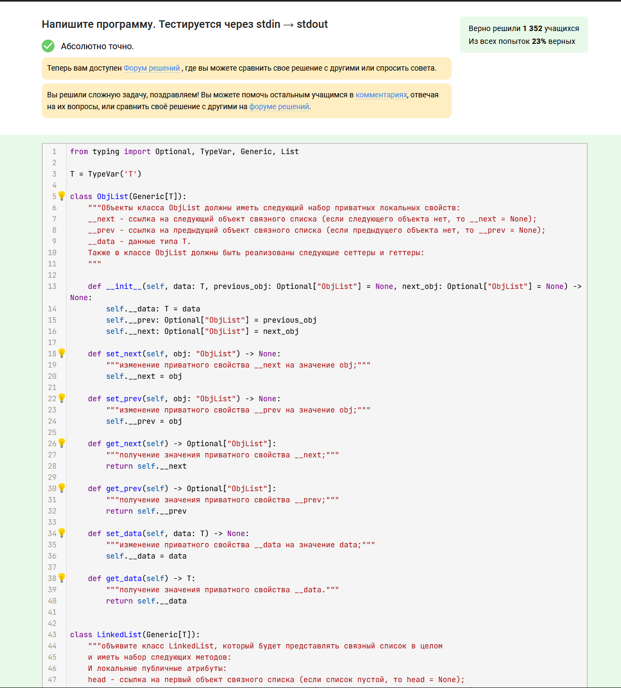
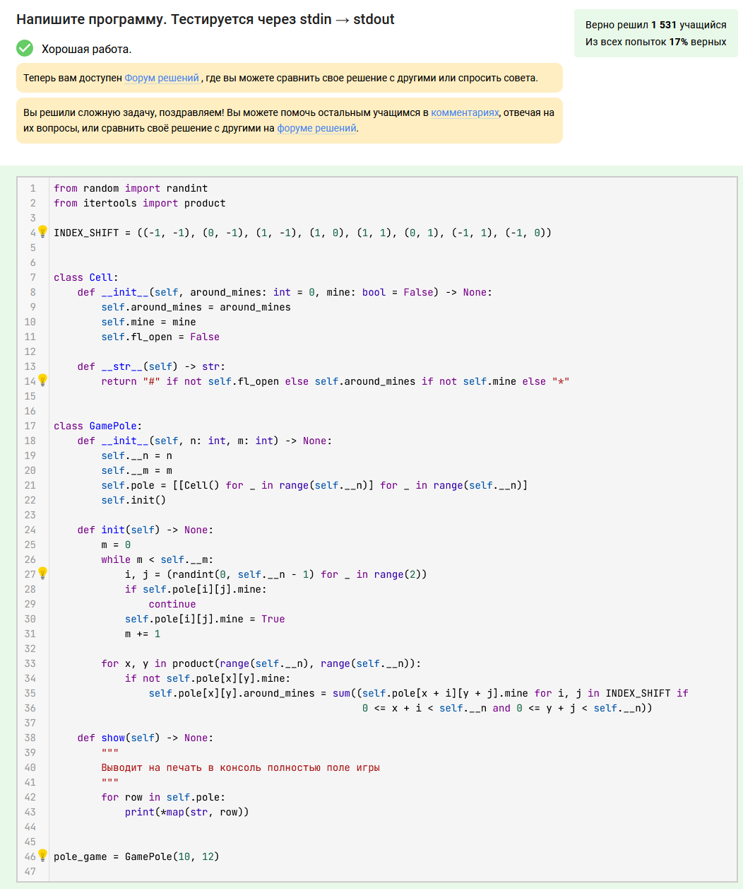
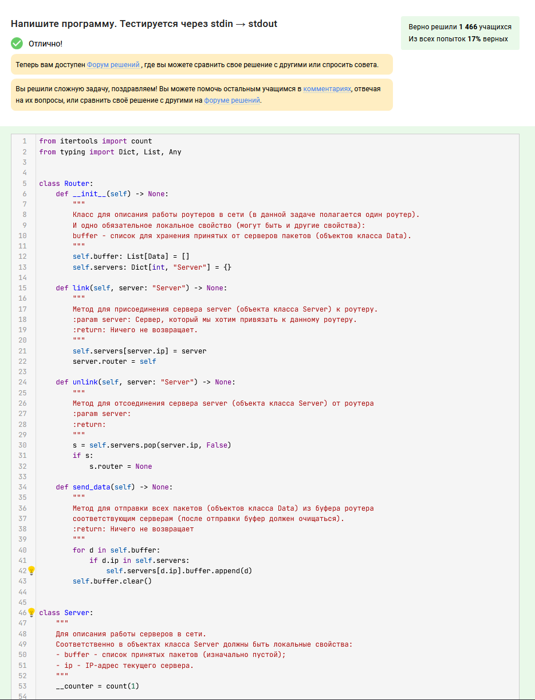

# Основы Python

В данном блоке предложено 3 задания на выполнение. Каждая директория - это задание. 

> [!IMPORTANT]
> Есть несколько файлов, которые подписаны по-разному. Что это означает? 
> Автор проходил данный курс от Сергея Балакириева, поэтому закрепил пару вариантов реализаций. 
> Файлы с названием `stepik.py` - решения, которые автоматически проходят проверку. 
> Другие же файлы - это собственные доработки, которые не пройдут тесты от Сергея. 

Здесь ниже закреплю результаты того, что тесты проходят на курсе. 

  
Задание 1. 

  

  
Задание 2. 

  

  
Задание 3. 

  

