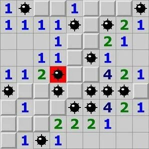

# Задание 2. 

Объявите два класса: 

`Cell` - для представления клетки игрового поля;
`GamePole` - для управления игровым полем, размером `N x N` клеток.

С помощью класса `Cell` предполагается создавать отдельные клетки командой:

```python
c1 = Cell(around_mines, mine)
```

Здесь `around_mines` - число мин вокруг данной клетки поля; `mine` - булева величина (`True/False`),
означающая наличие мины в текущей клетке.
При этом, в каждом объекте класса `Cell` должны создаваться локальные свойства:

- `around_mines` - число мин вокруг клетки (начальное значение 0);
- `mine` - наличие/отсутствие мины в текущей клетке (`True/False`);
- `fl_open` - открыта/закрыта клетка - булево значение (`True/False`). Изначально все клетки закрыты (`False`).



С помощью класса `GamePole` должна быть возможность создавать квадратное игровое поле с числом клеток `N x N`:

```python
pole_game = GamePole(N, M)
```

Здесь `N` - размер поля; `M` - общее число мин на поле. При этом, каждая клетка представляется объектом класса `Cell`
и все объекты хранятся в двумерном списке `N x N` элементов - локальном свойстве pole объекта класса `GamePole`. 

В классе `GamePole` должны быть также реализованы следующие методы:

- `init()` - инициализация поля с новой расстановкой M мин (случайным образом по игровому полю, разумеется каждая мина должна находиться в отдельной клетке).
- `show()` - отображение поля в консоли в виде таблицы чисел открытых клеток (если клетка не открыта, то
отображается символ #; мина отображается символом *; между клетками при отображении ставить пробел).

При создании экземпляра класса `GamePole` в его инициализаторе следует вызывать метод `init()` для первоначальной 
инициализации игрового поля.

В классе `GamePole` могут быть и другие вспомогательные методы.

Создайте экземпляр `pole_game` класса `GamePole` с размером поля `N = 10` и числом мин `M = 12`. 

P.S. На экран в программе ничего выводить не нужно.